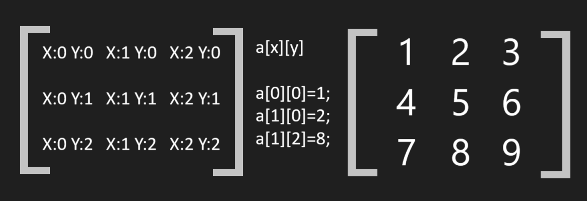

# la

created a common namespace "la" for convenience.  
It contains a class RegisterMatrix for creating a matrix and a MatrixMultiplication function

## Matrix Coordinates:

The coordinates of the matrix elements are implemented in a slightly unusual way:


## Class:
### RegisterMatrix:

When creating an object, it takes one integer value - the number of dimensions of the matrix: 
```
la::RegisterMatrix a(2); //creating 2D matrix named "a"
```
The class is created for simple use of matrix data by a function.  
Constructor performs dynamic memory allocation.  
The destructor automatically releases the used memory.  
The class also has a getDimensions() function that returns an integer - the number of dimensions in this matrix.  
Access to matrix elements is implemented through the [ ] operator.
```
a[0][2];
```

## Function:
### MatrixMultiplication:

The name of the function speaks for itself.  
MatrixMultiplication is a simple function for multiplying matrices with a time complexity of O(n^3), where n is the number of dimensions of the matrix.   
**TIP:** This function returns a 0D matrix with incorrect input data, so to check whether the function worked properly, you can use   
```if([name of result matrix].getDimensions()!=0)```
